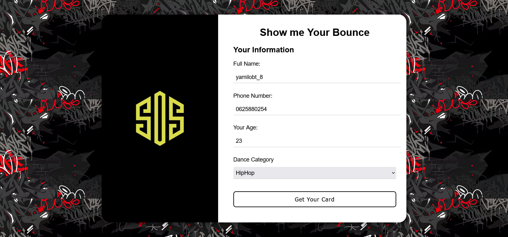
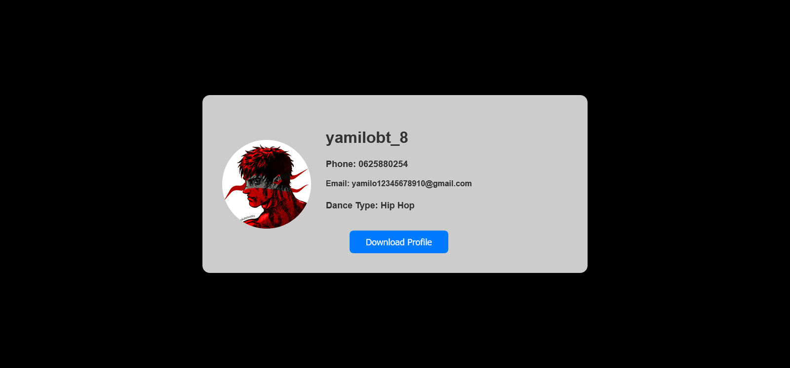

# Django WebApp: User Card Generator

This Django web application provides a form for users to fill out and generates a card based on data stored in a Google Sheet.

---

## 1. Start a Google Cloud Project

To enable access to Google Sheets, follow the instructions in this YouTube tutorial:
[Google Sheets API Setup](https://www.youtube.com/watch?v=zCEJurLGFRk&t=935s)

Watch until **minute 8:30** to correctly set up your Google Cloud project.

---

## 2. Start a Django Project

Create a new Django project by running:
```sh
django-admin startproject app_name
```

Navigate into the project directory:
```sh
cd app_name
```

---

## 3. Start a Django App (Optional)

If you want to separate functionality into an app, create an app named `card_generator`:
```sh
python manage.py startapp card_generator
```

Then, add `card_generator` to the `INSTALLED_APPS` list in `settings.py`.

---

## 4. Start a Python Virtual Environment (Optional)

Create and activate a virtual environment:
```sh
python -m venv venv
source venv/bin/activate  # On Windows use: venv\Scripts\activate
```

---

## 5. Install Requirements

Install the necessary Python libraries:
```sh
pip install gspread google-auth google-auth-oauthlib google-auth-httplib2 django
```

---

## 6. Replace Data with Your Own

- Replace `credentials.json` with your own Google API credentials.
- Update the `sheet_id` and other relevant data in your settings or environment variables.
- Modify the form and card template to match your requirements.

---

## 7. Run the Django Server

Apply migrations and start the Django development server:
```sh
python manage.py migrate
python manage.py runserver
```

---

## 8. Usage Instructions

1. Open your web browser and go to `http://127.0.0.1:8000/`
2. Fill out the form to generate a card.
3. The card will be displayed based on the data fetched from the Google Sheet.

---

## 9. Deploying the Application

To deploy the application, you can use services like Heroku, AWS, or PythonAnywhere. Ensure you configure environment variables correctly for production.

---

## Demo

## Steps to Use

1. **Fill in the Form**  
   Open the form page and fill in the required fields.

     
   *Figure 1: The form to be filled in.*

2. **Press "Get Your Card" Button**  
   After filling in the form, press the **"Get Your Card"** button to submit the data.

3. **Result**  
   Upon pressing the button, you will see the generated card as the result.

     
   *Figure 2: The generated card after pressing "Get Your Card".*

## Pull Requests

Feel free to submit a pull request if you have suggestions or ideas for optimizing the process or enhancing the project. Contributions are welcome, whether it's for improving functionality, adding new features, or refining the user experience.

Please ensure that your pull request:
- Is well-documented with clear explanations.
- Follows the existing coding style.
- Includes any necessary tests or modifications to ensure stability.

We appreciate your contributions and look forward to collaborating with you!


